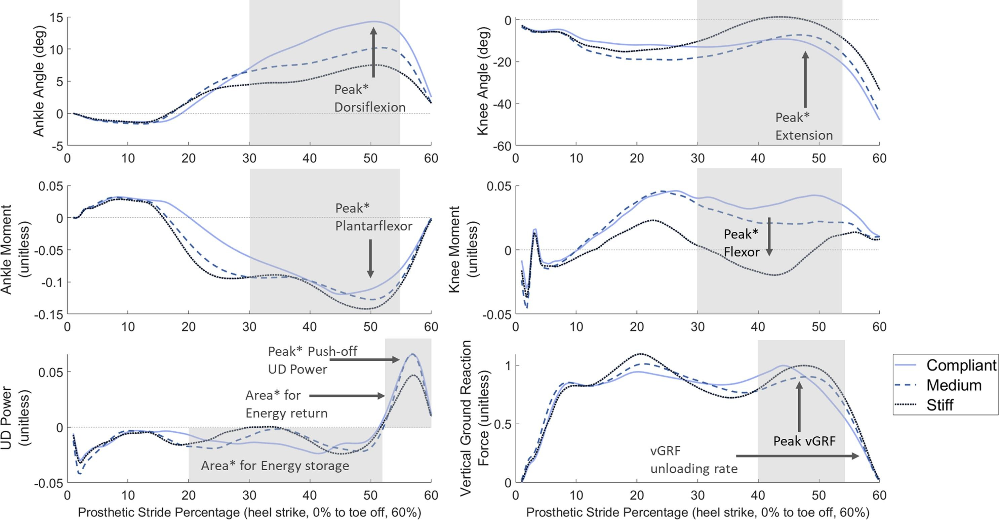
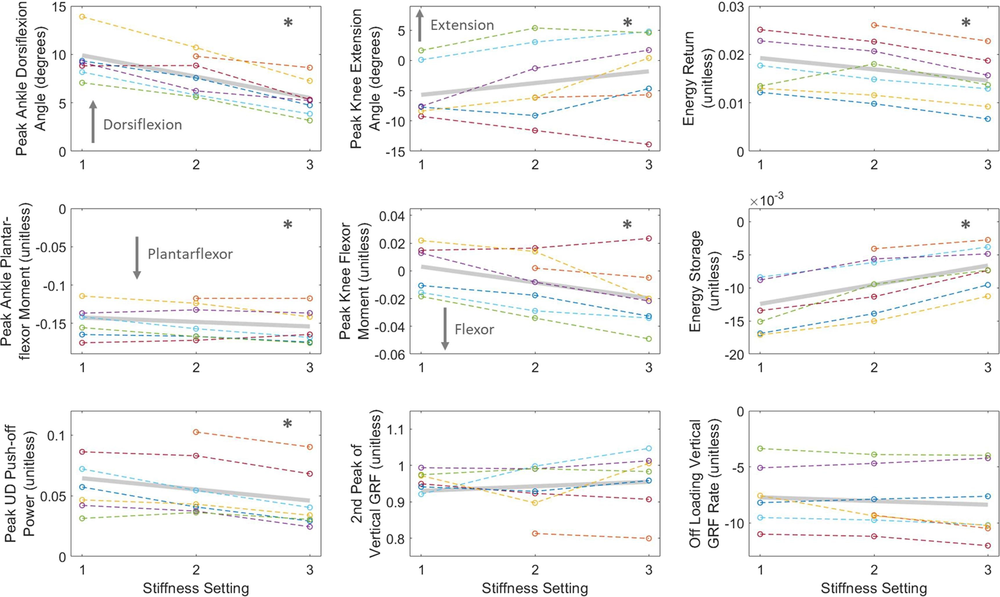

title: VSF Publication Post
Date: 2023-03-04 10:00
category: Posts

## Introduction
I would love to present my first 1st-author journal paper: [Sensitivity of lower-limb joint mechanics to prosthetic forefoot stiffness with a 
variable stiffness foot in level-ground walking](https://authors.elsevier.com/a/1gTp74-6-e4tq). You can access it for free til Mar 15. It presents 
my work on a prosthetic foot that can change stiffness. We tested our prosthesis, the Variable Stiffness Foot (VSF) on persons with below-the-knee 
amputations. 

## Method

 
Participants walked across two force plates in a motion capture lab wearing the VSF. Three successful trails were collected for each stiffness 
(Compliant, Medium, High) walking at a consistent self-selected speed. Some data had to be removed due to incomplete contact with force plates, 
faults in the VSF, and missing markers. A synchronization algorithm was used to align the force plate and motion capture data for a few participants.

## Results

Prosthetic-side joint mechanics for a representative subject walking with the Variable Stiffness Foot (VSF). First row is prosthetic angles for ankle 
and knee; second row is the prosthetic moments for the ankle and knee; the third row is the Unified Deformable-body (UD) push-off power and vertical 
ground reaction force for the prosthetic side. Mean curves across trials for each stiffness condition are plotted, and data is shown for the prosthetic 
stance phase from heel strike to toe-off. Grey rectangles represent the region of concern for each variable where the peaks or areas are considered. 
Asterisks were included after the words, 'area' and 'peak' to highlight the variables which had statistical significance with changes in stiffness.

Linear mixed-effect regressions for ankle and knee angles and moments, Unified Deformable-body (UD) power, prosthesis energy storage and energy return, 
vertical Ground Reaction Force (vGRF), and vGRF offloading rate for the non-dimensionalized data, with respect to stiffness settings. Stiffness settings 
1, 2, 3 relate to Compliant, Medium, and Stiff stiffnesses, respectively. The grey bar represents the linear mixed effects fit of all subjects. 
One subject did not have data for the lowest stiffness setting. Asterisks were included in the top right area for the variables which had 
statistical significance with changes in stiffness.
  
Results showed that increased VSF stiffness led to decreased peak ankle dorsiflexion angle, increased peak plantarflexor moment, increased peak 
knee extension angle, increased peak flexor knee moment, decreased magnitudes of peak UD power, energy return, and energy storage.

## Limitations
Along with improvements in the experimental design, future work should include a larger sample size, more trials per participant, and a more acclimation
time with the VSF. Two other considerations could be to use variable lengths for the VSF and walk at multiple controlled speeds to investigate the 
potential effect of walking speed on lower-body biomechanics.

## Conclusion
Specifically, these results imply lower ankle, knee, and hip moments and more ankle angle range of motion using a less stiff VSF during level-ground 
walking. These results can provide crucial feedback in developing a real-time prosthetic controller that can optimize walking mechanics based on 
terrain and walking preferences. 
This research is the first third of my Ph.D work and I am thankful to be working with Dr. Peter Adamczyk. Also, I'm excited to share that the rest of my Ph.D. focuses on a prosthetic 
ankle called TADA: Two Axis aDaptable Ankle! More info to come.

## References
"Sensitivity of Lower-Limb Joint Mechanics to Prosthetic Forefoot Stiffness with a Variable Stiffness Foot in Level-Ground Walking." 
Journal of Biomechanics, vol. 147, 2023, p. 111436,  [https://doi.org/10.1016/j.jbiomech.2023.111436](https://doi.org/10.1016/j.jbiomech.2023.111436). Accessed 4 Mar. 2023.